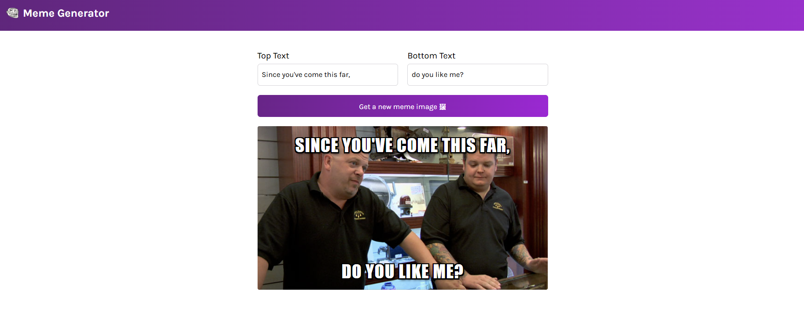

# Meme Generator (React Practice)

This is a React practice project where I created a meme generator app while learning concepts like components, props, state, and event handling.

##  What I Learned
- React functional components
- Props and state handling
- useState & useEffect hooks
- Vite project setup
- Mapping data to JSX

##  Tech Stack
- React
- Vite
- JavaScript
- CSS

##  Preview

